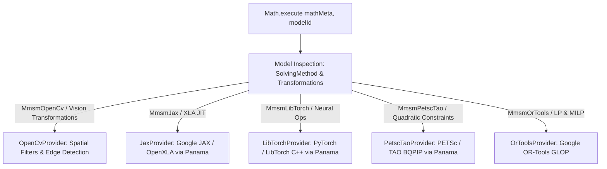

# Groovy Math

Groovy Math is a declarative, in-memory mathematical model and DSL for Groovy.
It carries the semantics of the Moqui Math model without requiring the Moqui
runtime or a database.

The project is not a numerical execution engine. A Groovy DSL builds and
configures `MathMeta`, a typed in-memory metadata set; provider implementations
validate and lower it to platform-specific execution, initially PyTorch/LibTorch.

## Architecture

```text
Groovy Math DSL
      |
      v
MathMeta
      |
      v
MathProvider SPI
      |
      +-- PyTorch provider -> LibTorch
      +-- OR-Tools provider -> GLOP
      +-- PETSc/TAO provider -> BQPIP
      +-- future local or distributed providers
```

The executor never parses arbitrary Groovy source. Groovy evaluates the DSL in
a controlled JVM environment and produces validated `MathMeta`. A
`MathProvider<P, R>` compiles that metadata directly into its own plan type `P` and
returns its own execution result type `R`.

## Modules and API

The library contains four boundaries:

- `model`: schema definitions, map-backed values, named containers and lazy
  providers;
- `dsl`: seed-style Groovy evaluation and the normalized `MathMeta` root;
- `moqui`: structural loading of `MathEntities.xml`, without a Moqui runtime;
- `spi`: the provider compilation and execution boundary.

The collection contracts follow Gradle's domain-object model: `register` and
`named` are lazy, `create` and `getByName` are eager, filtered collections are
live, and `configureEach` applies to existing and future matching objects.

## DSL Styles: Dynamic & Type-Safe Fluent API

Groovy Math supports two complementary DSL paradigms:

### 1. Dynamic Seed-Style DSL
Mirrors Moqui seed-data records, using relationship-driven nested blocks and Gradle-style object lifecycles:

```groovy
MathModelDef('MatrixAlgebra', modelTypeEnum: MathModelType.LinearAlgebra) {
    MathModel('MatrixProduct', statusId: 'MathModelDraft') {
        data('LeftMatrixData', dataTypeEnum: MathModelDataType.Matrix, matrixId: 'A') {
            Matrix('A', rows: 2, cols: 3, purposeEnum: MatrixPurpose.Original)
        }
        data('ProductStep', dataTypeEnum: MathModelDataType.Transformation, transformationId: 'MultiplyAB') {
            Transformation('MultiplyAB', transformationTypeEnum: TransformationType.MatrixProduct, resultMatrixId: 'C') {
                operands(operandIndex: 0, operandTypeEnum: TransformationOperandType.LeftMatrix, operandMatrixId: 'A')
                operands(operandIndex: 1, operandTypeEnum: TransformationOperandType.RightMatrix, operandMatrixId: 'B')
            }
        }
    }
}
```

### 2. Type-Safe Fluent API (JPA Criteria Metamodel Style)
Provides full compile-time safety (`@CompileStatic`), IDE auto-completion, static attributes (`Matrix_`, `Graph_`, `GraphVertex_`), and object handles (`EntityRef<T>`):

```groovy
MathMeta mathMeta = MathDsl.fluent(schemaFile) {
    graph('ResearchLabGraph') {
        name 'AI Research Institute Graph'

        // Strongly-typed vertices
        def alice = vertex('Alice') {
            label 'Alice Cooper'
            parameter('jobTitle', 'Principal AI Scientist')
        }
        def bob = vertex('Bob') { label 'Bob Martin' }
        def aiDept = vertex('AI_Department') { label 'Neuro-Symbolic Lab' }

        // Connect edges type-safely via EntityRef (zero manual string IDs)
        connect(alice, aiDept, 'leads')
        connect(bob, aiDept, 'memberOf')
        connect(alice, bob, 'supervises')
    }
}
```

### Separated Models and Pipeline Runners

All declarations in `examples/` are cleanly decoupled into **declarative model files** and **runtime execution runners**:

| Model File | Execution Runner | Backend Engine |
| :--- | :--- | :--- |
| [`examples/matrix-product.groovy`](examples/matrix-product.groovy) | [`examples/run-pytorch-matrix-product.groovy`](examples/run-pytorch-matrix-product.groovy) | **LibTorch Panama C++** |
| [`examples/matrix-product.groovy`](examples/matrix-product.groovy) | [`examples/run-jax-pipeline.groovy`](examples/run-jax-pipeline.groovy) | **LibTorch vs Google JAX Panama** |
| [`examples/opencv-vision-pipeline.groovy`](examples/opencv-vision-pipeline.groovy) | [`examples/run-opencv-pipeline.groovy`](examples/run-opencv-pipeline.groovy) | **OpenCV Panama C++** |
| [`examples/energy-dispatch.groovy`](examples/energy-dispatch.groovy) | [`examples/run-petsctao-energy-dispatch.groovy`](examples/run-petsctao-energy-dispatch.groovy) | **PETSc / TAO BQPIP Panama** |
| [`examples/production-plan.groovy`](examples/production-plan.groovy) | [`examples/run-ortools-production-plan.groovy`](examples/run-ortools-production-plan.groovy) | **Google OR-Tools GLOP** |
| [`examples/jena-knowledge-graph.groovy`](examples/jena-knowledge-graph.groovy) | [`examples/run-jena-graph-sparql.groovy`](examples/run-jena-graph-sparql.groovy) | **Apache Jena RDF / OWL / SPARQL** |

Here `categoryId` is inherited by `objects` and `morphisms`, while `morphismId`
is inherited by `parameters`. Records are stored in their normal entity
containers; nesting is the declarative authoring form, not a denormalized
runtime representation. A relationship may alternatively be used as a
Gradle-style container:

```groovy
Category('AgentEntityModel') {
    objects {
        CategoryObject('BillingAccountObject') { objectName 'BillingAccount' }
        PartyObject(objectName: 'Party')
    }
}
```

Simple seed records may also be written entirely as named arguments:

```groovy
MathModel(mathModelId: 'Classifier', mathModelDefId: 'NeuralNetwork', statusId: 'MathModelDraft')
```

Each entity name is resolved against the loaded schema. Each field assignment
is validated, required values are checked on realization, and composite primary
keys are preserved.

Default expressions originating in Moqui, such as `ec.user.nowTimestamp`, are
preserved as schema metadata. They are not executed by the standalone DSL.

The resulting `MathMeta` exposes containers such as:

```groovy
mathMeta.MathModel.named('Classifier')
mathMeta.MathModel.matching { it.mathModelDefId == 'NeuralNetwork' }
    .configureEach { description 'Selected model' }
mathMeta.MathModel.remove('ObsoleteModel')
mathMeta.validate()
mathMeta.freeze() // validate, realize and prohibit structural mutation
```

The container lifecycle follows Gradle's domain-object collection contract:

```groovy
def models = mathMeta.MathModel

models.register('Deferred') { /* lazy */ }
models.create('Immediate') { /* eager */ }
models.named('Deferred')                 // lazy provider
models.getByName('Deferred')             // eager value
models.names                             // does not realize values
models.configureEach { /* lazy action */ }
models.all { /* eager action */ }
models.disallowChanges()                 // freeze metadata structure
models.configure { NamedModel { /* create if missing, like Gradle */ } }
```

The precise mapping and realization rules are documented in
[`docs/gradle-collection-semantics.md`](docs/gradle-collection-semantics.md).

Use `MathDsl.evaluate(schemaDefinition, dslFile)` or
`MathDsl.evaluate(mathEntitiesXml, dslFile)` to read a DSL file. DSL files are
trusted executable Groovy configuration, like `build.gradle`; this API is not a
sandbox for untrusted input.

## Provider SPI

The SPI does not add another public IR:

```groovy
interface MathProvider<P, R> {
    String getProviderId()
    P compile(MathMeta mathMeta)
    R execute(P plan, Map<String, ?> inputs)
}
```

The included LibTorch provider owns `LibTorchPlan` and a narrow JNI bridge. It
currently lowers `TtMatrixProduct`, `TtAffine` and `TtTensorReLu`, accepts Java arrays or reusable
direct buffers, and permits concurrent inference on one immutable native plan.

The included OR-Tools provider lowers `MmtLp` models to the native GLOP linear
solver through the official OR-Tools Java API. Its initial contract is the
standard linear program:

```text
maximize or minimize c^T x
subject to A x <= b
and variable lower/upper bounds
```

`MathModelData.purposeEnumId` identifies the decision-variable names
(`MmdpDecisionVars`), cost vector (`MmdpCostVector`), constraint matrix
(`MmdpConstraintMatrix`), right-hand side (`MmdpRhsVector`) and optional 2 x n
lower/upper-bound matrix (`MmdpVarBounds`). The model parameter with alias
`objectiveSense` must contain `MAXIMIZE` or `MINIMIZE`. Values are declared as
JSON in `Vector.componentArray` and `Matrix.componentArray`; execution does not
parse the Groovy source again. This first version deliberately rejects runtime
coefficient overrides and model types other than LP.

Other providers may compile the same metadata to Spark, Flink, a remote service or
a distributed runtime without changing the DSL.

The PETSc/TAO provider lowers `MmtQp` metadata to a native bound-constrained
quadratic program:

```text
minimize 0.5 x^T Q x + c^T x
subject to lower <= x <= upper
```

It selects TAO `BQPIP` and uses `PETSC_COMM_SELF` in the initial embedded JNI
backend. This is a real native TAO execution, but intentionally single-process;
the backend serializes PETSc entry because it cannot assume that an arbitrary
PETSc/MPI build is thread-safe. A future MPI backend can implement the same
`PetscTaoBackend` boundary using a separately launched executor and
`PETSC_COMM_WORLD`, without changing the DSL. See
[`docs/petsctao-provider.md`](docs/petsctao-provider.md) for the metadata mapping,
native lifecycle and distributed boundary.

## Unified Engine Dispatch Architecture (Project Panama & Native Providers)

Groovy Math provides a unified dispatching engine (`groovy.math.Math`) built on **Java 21 Project Panama (Foreign Function & Memory API)**. The engine inspects the declarative `MathMeta` model, solving method (`solvingMethodEnumId`), and transformation operators to route execution directly to the most appropriate native computational backend with zero JVM copy overhead.



### Supported Providers & Native Capabilities

| Provider | Engine / Runtime | Integration Type | Target Domain |
| :--- | :--- | :--- | :--- |
| **`PyTorch` / `LibTorch`** | LibTorch 2.7+ C++ | Java 21 Panama Downcall | Linear Algebra, Affine Layers, Softmax, Categorical Masking |
| **`Google JAX`** | OpenXLA / JAX / PJRT | Java 21 Panama C ABI | JIT-compiled tensor operations, auto-differentiation |
| **`OpenCV`** | OpenCV 5+ Computer Vision | Java 21 Panama C ABI | Gaussian Smoothing, Sobel Gradient, 2D Convolution, Affine Warping |
| **`PETSc / TAO`** | PETSc 3.24+ TAO BQPIP | Java 21 Panama C ABI | Bounded quadratic optimization, large-scale PDE solvers |
| **`Google OR-Tools`** | OR-Tools GLOP / CP-SAT | Java SPI | Mixed-integer linear programming, production scheduling |
| **`Apache Jena`** | Apache Jena 5+ ARQ | Java SPI / Semantic Engine | RDF Triples, OWL Inference, SPARQL 1.1 Query Engine, Turtle / JSON-LD |

### Unified Dispatch Usage

```groovy
import groovy.math.Math
import groovy.math.dsl.MathDsl
import groovy.math.dsl.MathMeta

MathMeta mathMeta = MathDsl.evaluate(schemaFile, dslFile)

// Automatically routed to the optimal native engine (e.g., OpenCV for vision, Torch/JAX for tensors)
def result = Math.execute(mathMeta, 'EdgePipeline') {
    input 'Image', inputMatrix
}
```

## Build & Test

Requires JDK 21 or newer with `--enable-preview`.

```shell
# Run all unit tests and standard checks
./gradlew check

# Run Native LibTorch Panama suite
./gradlew nativeTest

# Run Native Google JAX Panama suite
./gradlew jaxNativeTest

# Run Native OpenCV Panama suite
./gradlew openCvNativeTest

# Run Native PETSc/TAO Panama suite
./gradlew petscTaoNativeTest

# Run Dual-Engine Pipeline (LibTorch vs Google JAX comparison)
./gradlew runJaxPipeline

# Run OpenCV Vision Pipeline example
./gradlew runOpenCvPipeline

# Run Apache Jena Semantic Graph & SPARQL example
./gradlew runJenaGraphSparql
```

## License

CC0 1.0 Universal with the additional Grant of Patent License in
[`LICENSE.md`](LICENSE.md), matching Moqui public-domain projects.
